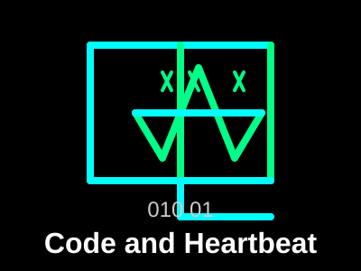

<div align="center">
  
  
  
  
  
</div>

<div align="center">
  
  <h1>🎮 Code and Heartbeat</h1>
  <p><i>A Web-Based Visual Novel Game</i></p>
</div>

<div align="center">
  
  
  
</div>

---

## 📖 Project Introduction

**Code and Heartbeat** is an immersive web-based visual novel (Galgame) that tells the heartwarming story of a freshman computer science student at Shanghai Jiao Tong University and their genius roommate. The game masterfully combines romantic storytelling with programming knowledge to create a unique and engaging experience for players.

### 🎯 Key Highlights

- **Game Type**: Visual Novel + Romance Simulation
- **Themes**: Campus life, friendship, love, programming
- **Target Audience**: Players who enjoy visual novels and programming
- **Language Support**: English & Chinese

---

## ✨ Core Features

| Feature | Description |
|---------|-------------|
| 💬 **Dialogue System** | Rich dialogue content and character interactions |
| ❤️ **Affinity System** | Player choices affect character relationships |
| 🎭 **Multiple Endings** | Different choices lead to different outcomes |
| 💾 **Save System** | Supports manual saving and auto-saving |
| ⚙️ **Settings System** | Adjustable text speed, volume, etc. |
| 💻 **Programming Knowledge** | Integrates real programming concepts and algorithm knowledge |

---

## 🛠️ Technology Stack

<div align="center">
  
  
  
  
  
  
</div>

---

## 🚀 Quick Start

### 📋 Environment Requirements

- **Node.js**: 18+
- **pnpm**: 9+

### 📦 Install Dependencies

```bash
pnpm install
```

### 🔥 Start Development Server

```bash
pnpm dev
```

After starting, open [http://localhost:3000](http://localhost:3000) in your browser to start the game.

### 🏗️ Build Production Version

```bash
pnpm build
```

### 🌐 Start Production Server

```bash
pnpm start
```

---

## 📁 Project Structure

```
Code_and_Heartbeat/
├── public/                 # Static resources (images, audio, etc.)
├── scripts/                # Build and start scripts
├── src/
│   ├── app/                # Page routes and layout
│   │   ├── layout.tsx      # Root layout
│   │   ├── page.tsx        # Main page (game entry)
│   │   └── globals.css     # Global styles
│   ├── components/         # React components
│   │   ├── ui/             # Shadcn UI component library
│   │   └── game/           # Game components
│   │       ├── GameScreen.tsx      # Main game interface
│   │       ├── DialogueBox.tsx     # Dialogue box
│   │       ├── ChoiceCard.tsx      # Choice cards
│   │       ├── AffinityDisplay.tsx # Affinity display
│   │       ├── GameMenu.tsx        # Game menu
│   │       ├── SettingsPanel.tsx   # Settings panel
│   │       └── SaveLoadPanel.tsx   # Save/load panel
│   ├── contexts/           # React Context
│   │   └── GameContext.tsx # Global game state management
│   ├── hooks/              # Custom Hooks
│   ├── lib/                # Utility library
│   │   ├── game/           # Game core logic
│   │   │   ├── types.ts    # Type definitions
│   │   │   ├── data.ts     # Game data (scenes, characters, endings)
│   │   │   ├── saveSystem.ts   # Save system
│   │   │   ├── affinity.ts     # Affinity system
│   │   │   └── settings.ts     # Game settings
│   │   └── utils.ts        # General utility functions
│   └── server.ts           # Custom server entry
├── next.config.ts          # Next.js configuration
├── package.json            # Project dependency management
└── tsconfig.json           # TypeScript configuration
```

---

## 🎮 Gameplay

1. **🎬 Start Game**: After entering the game, click the "Start Game" button to begin your story
2. **📖 Read Dialogue**: Click the screen or press space to advance dialogue
3. **🤔 Make Choices**: When options appear, select the response you want
4. **❤️ Check Affinity**: The top right corner of the screen shows your affinity with Ding Le
5. **📋 Use Menu**: Press ESC or click the menu button to open the game menu
6. **💾 Save/Load**: In the menu, you can save your progress or load previous saves
7. **⚙️ Adjust Settings**: In the settings panel, adjust various game parameters

---

## 👨‍💻 Development Guide

### 📝 Adding New Story Content

1. Add new scenes in `src/lib/game/data.ts`
2. Ensure each scene has a unique `id`
3. Set the correct `nextSceneId` or `choices`
4. Use `SCENE_MAP` to ensure scenes are accessible

### 🎯 Adding New Choices

1. Add options to the scene's `choices` array
2. Set `affinityChange` to affect affinity
3. Use `addFlags` to add markers for condition checking

### 🎨 Modifying UI

1. All UI components use shadcn/ui
2. Follow the theme color scheme (use semantic class names like `bg-background`, `text-foreground`)
3. Use Tailwind CSS for style customization

---

## 📦 Package Management Guidelines

<div align="center">
  
</div>

**⚠️ Only use pnpm** as the package manager, **do not use npm or yarn**.

**Common commands**:
- Install dependencies: `pnpm add <package>`
- Install dev dependencies: `pnpm add -D <package>`
- Install all dependencies: `pnpm install`
- Remove dependencies: `pnpm remove <package>`

---

## ⚠️ Notes

1. **Hydration Error Prevention**: Do not directly use dynamic data like `typeof window` or `Date.now()` in JSX rendering logic. Must use `'use client'` with `useEffect` + `useState`.
2. **Theme Consistency**: Use semantic Tailwind class names (`bg-background`, `text-foreground`), avoid hard-coded colors.
3. **TypeScript Strict Mode**: All function parameters must be typed, no implicit any.

---

## 🤝 Contribution Guide

Welcome to contribute to the game! If you have any suggestions or want to add new content, please:

1. 🍴 Fork this repository
2. 🌿 Create a new branch
3. 💻 Make your changes
4. 📤 Submit a Pull Request

---

## 📄 License

<div align="center">
  
</div>

This project is licensed under the MIT License.

---

## 👤 Author

<div align="center">
  <h3>🎮 Tnt_next</h3>
  <p>Game Developer & Content Creator</p>
  
  <a href="https://space.bilibili.com/3546659195718047" target="_blank">
    
  </a>
  
  <p>📺 Check out my Bilibili channel for more content!</p>
</div>

---

## 📞 Contact

If you have any questions or suggestions, please contact us through:

- 📧 Email: cyy_zdwxx@163.com
- 🐙 GitHub: [https://github.com/TNTnext](https://github.com/TNTnext)
- 📺 Bilibili: [https://space.bilibili.com/3546659195718047](https://space.bilibili.com/3546659195718047)

---

## 🤖 AI Development

<div align="center">
  
</div>

<div align="center">
  <p><i>This project was developed with the assistance of AI technology.</i></p>
  <p>The game code, documentation, and creative elements were generated and enhanced using advanced AI tools, combining human creativity with artificial intelligence to create an engaging gaming experience.</p>
</div>

---

## 🌍 Language

<div align="center">
  <a href="README.md">
    
  </a>
  <a href="README.zh.md">
    
  </a>
</div>

---

<div align="center">
  <p><i>Made with ❤️ by Tnt_next & AI</i></p>
  <p>⭐ Star this repository if you like it! ⭐</p>
</div>